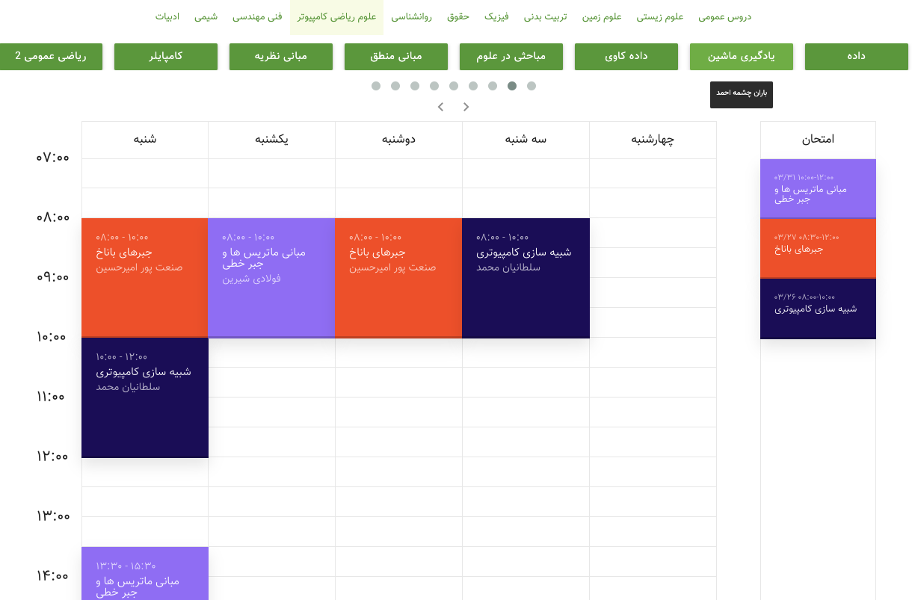

# Termustat

**An online timetabling tool for Iranian university students**  

Termustat sits on top of the [Golestan Integrated University System](https://fa.wikipedia.org/wiki/%DA%AF%D9%84%D8%B3%D8%AA%D8%A7%D9%86_(%D9%86%D8%B1%D9%85_%D8%A7%D9%81%D8%B2%D8%A7%D8%B1)), powering course planning at many Iranian universities.



## Features

- **Course Planner**: Easily add, remove, and rearrange courses on a visual calendar.
- **Conflict Detection**: Highlights time overlaps and warns of schedule clashes.
- **Dynamic Filtering**: Search and filter by faculty, professor, semester, or keywords.
- **Email Notifications**: Built‑in support for password resets and email verification.
- **Data Import/Export**: Uses the “engine” module to parse and transform Golestan exports into structured JSON.

## Tech Stack

| Component  | Language / Framework    |
| ---------- |-------------------------|
| **Backend**| Go          |
| **Engine** | Go                      |
| **Frontend**| React |
| **Database**| PostgreSQL              |
| **Containerization** | Docker & Docker Compose |


## Getting Started

### Configuration

1. Copy the example environment file and fill in your values:

   ```bash
   cp .env.example .env
   ```
2. Edit `.env`:

   ```dotenv
   DB_HOST=postgres
   DB_NAME=termustat
   DB_USER=your_user
   DB_PASSWORD=your_password
   TIMEZONE=Asia/Tehran
   JWT_SECRET=supersecret
   MAILGUN_DOMAIN=...
   MAILGUN_API_KEY=...
   ```

### Development (Docker)

This spins up the API, engine, and frontend in live‑reload mode:

```bash
docker-compose -f docker-compose.yml -f docker-compose.dev.yml up --build
```

- **Frontend** on `http://localhost:3000`
- **API** on `http://localhost:8080/api`

### Production (Docker Compose)

> [!WARNING]
> Termusat is currently undergoing a full refactor and is not yet ready for production use.

Build and run all services:

```bash
docker-compose up -d --build
```

- **Nginx** serves the frontend on `http://localhost:8080`
- **API**, **Engine**, and **PostgreSQL** run behind the scenes


## API Documentation

Auto‑generated Swagger docs are available at:

```
GET /api/docs/swagger.yaml
GET /api/docs/swagger.json
```

Or browse the UI:

```
http://localhost:8080/api/v1/swagger/index.html
```

## Architecture

```
┌──────────┐    ┌──────────────┐    ┌────────────┐
│ Golestan │───▶│  Engine      │───▶│  API       │───▶ PostgreSQL
│ Export   │    │ (Parser &    │    │ (Handlers, │
└──────────┘    │ Transformer) │    │  Services) │
                └──────────────┘    └────────────┘
                                         │
                                         ▼
                                      Frontend
                                      (React)
```

- **Engine**
    - Parses raw HTML/SQL exports from Golestan
    - Converts into normalized Go models
- **API**
    - Exposes REST endpoints for courses, faculties, semesters, users, etc.
    - Handles authentication, authorization, email workflows
- **Frontend**
    - Interactive calendar UI
    - Dynamic course selection & filtering


## Contributing

1. Fork the repo
2. Create a feature branch
3. Commit your changes & push
4. Open a Pull Request

Please ensure all new code is covered by tests and linted.


## License

This project is licensed under the **GNU General Public License v3.0**. See [LICENSE](LICENSE) for details.


## Resources

- [Arman Jafarnezhad](https://linkedin.com/in/ArmanJ), Author
- [Safar-o-Yek Magazine](https://t.me/sefroyekpub/43), “From Hesarak to Abbaspur” article